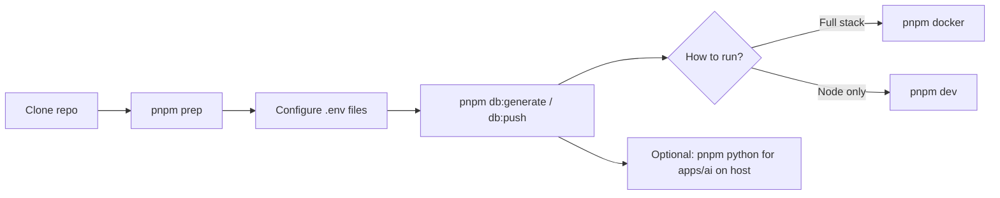

# Idest

Monorepo for the Idest English teaching platform: Next.js frontend, NestJS APIs, a Python AI service, and shared packages.

## Repository layout

| Path | Role |
|------|------|
| [`apps/website`](apps/website) | Next.js web app |
| [`apps/server`](apps/server) | Main NestJS API (Prisma + PostgreSQL) |
| [`apps/assignments`](apps/assignments) | Assignments NestJS service (MongoDB) |
| [`apps/ai`](apps/ai) | FastAPI / Python scoring and ML |
| [`packages/shared`](packages/shared) | Shared TypeScript package (`@idest/shared`) |

Workspace packages are declared in [`pnpm-workspace.yaml`](pnpm-workspace.yaml).

## Prerequisites

- **Node.js** 18+ (LTS recommended)
- **pnpm** (install: `corepack enable && corepack prepare pnpm@latest --activate`, or see [pnpm installation](https://pnpm.io/installation))
- **Docker** and **Docker Compose** (for running the full stack via [`docker-compose.yml`](docker-compose.yml))
- **Python** 3.11 if you run or develop [`apps/ai`](apps/ai) on the host (not only inside Docker)
.

## Environment variables

- **[`.env.example`](.env.example)** lists variables used across the monorepo. Copy the sections you need into each app’s own `.env` (this repo does not load a single root `.env` for all apps).

Typical files:

- `apps/server/.env` — `DATABASE_URL`, JWT, Supabase, Stripe, LiveKit, service URLs, etc.
- `apps/assignments/.env` — MongoDB, shared JWT/Supabase-style keys aligned with server where documented
- `apps/website/.env` — `NEXT_PUBLIC_*` and any server-only secrets your Next config expects

**Before `pnpm db:push`:** set `DATABASE_URL` (and any Prisma-related vars you use) in `apps/server/.env`, and ensure the database is running.

**Before `pnpm docker`:** fill env files enough for server, assignments, and website to boot; Compose also reads optional overrides such as `WEBSITE_PORT` / `SERVER_PORT` (see `.env.example`).

## Suggested onboarding flow

1. **Install Node dependencies (all workspaces)**

   ```bash
   pnpm prep
   ```

2. **Configure environment** — copy from `.env.example` into `apps/server/.env`, `apps/assignments/.env`, and `apps/website/.env` as needed, and fill values for your environment.

3. **Prisma (server)**

   ```bash
   pnpm db:generate
   pnpm db:push
   ```

   Requires a valid `DATABASE_URL` and a reachable database for `db:push`.

4. **Python dependencies (AI app, local use)** — optional if you only run AI via Docker

   ```bash
   pnpm python
   ```

5. **Run the stack with Docker Compose**

   ```bash
   pnpm docker
   ```

   This runs `docker compose up` from the repo root. For a detached run: `docker compose up -d`. First-time or after Dockerfile changes: `docker compose up --build` or `docker compose build` then `pnpm docker`.

6. **Local development without the full Docker stack** — run workspace dev scripts in parallel:

   ```bash
   pnpm dev
   ```

   You still need databases and env vars configured per app.



## Root scripts

| Script | Description |
|--------|-------------|
| `pnpm prep` | `pnpm install` for the whole workspace (all `apps/*` and `packages/*`) |
| `pnpm docker` | `docker compose up` using [`docker-compose.yml`](docker-compose.yml) |
| `pnpm db:generate` | Generate Prisma Client in `apps/server` |
| `pnpm db:push` | Push Prisma schema to the database (`apps/server`) |
| `pnpm python` | Install Python deps from `apps/ai/requirements.txt` |
| `pnpm dev` | Run `dev` in every workspace package in parallel |
| `pnpm build` | Build all workspace packages |
| `pnpm lint` | Lint all workspace packages |
| `pnpm format` | Format TypeScript sources with Prettier (paths in `package.json`) |

## Docker Compose services (overview)

[`docker-compose.yml`](docker-compose.yml) includes **website**, **server**, **assignments**, **ai**, and **kokoro** (TTS). Ports and env wiring are defined there; adjust host ports via variables such as `WEBSITE_PORT` / `SERVER_PORT` if needed.

## Further reading

- [Idest Server](apps/server/README.md) — NestJS, Prisma, API details
- [Idest Website](apps/website/README.md) — Next.js frontend
- [Idest Assignments](apps/assignments/README.md) — assignments service
