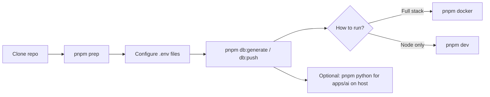

# Idest

Monorepo for the Idest English teaching platform: Next.js frontend, NestJS APIs, a Python AI service, and shared packages.

## Repository layout

| Path | Role |
|------|------|
| [`apps/website`](apps/website) | Next.js web app |
| [`apps/server`](apps/server) | Main NestJS API (Prisma + PostgreSQL) |
| [`apps/assignments`](apps/assignments) | Assignments NestJS service (MongoDB) |
| [`apps/ai`](apps/ai) | FastAPI / Python scoring and ML |
| [`packages/shared`](packages/shared) | Shared TypeScript package (`@idest/shared`) |

Workspace packages are declared in [`pnpm-workspace.yaml`](pnpm-workspace.yaml).

## Prerequisites

- **Node.js** 18+ (LTS recommended)
- **pnpm**
- **Docker** and **Docker Compose** (for running the full stack via [`docker-compose.yml`](docker-compose.yml))
- **Python** 3.11+ if you run or develop [`apps/ai`](apps/ai) on the host (not only inside Docker)
- **PostgreSQL** reachable via `DATABASE_URL` in `apps/server` — not started by this repo’s Compose file; use local Postgres, another container, or a hosted DB

See [Installing Node, pnpm, Python, and Docker](#installing-node-pnpm-python-and-docker) below for step-by-step setup on **macOS** and **Windows**.

## Installing Node, pnpm, Python, and Docker

### macOS

1. **Node.js**  
   - **Installer:** Download the LTS build from [nodejs.org](https://nodejs.org/) and run it.  
   - **Homebrew:** `brew install node` (or a specific major, e.g. `brew install node@20`).  
   - **nvm (optional):** [nvm](https://github.com/nvm-sh/nvm) lets you switch versions: `nvm install --lts` then `nvm use --lts`.  
   Verify: `node -v` (should be v18 or newer).

2. **pnpm**  
   Node 16.13+ ships with **Corepack** (recommended):

   ```bash
   corepack enable
   corepack prepare pnpm@latest --activate
   ```

   Alternatives: `brew install pnpm`, or `npm install -g pnpm`.  
   Verify: `pnpm -v`.

3. **Python**  
   - **Installer:** [python.org/downloads](https://www.python.org/downloads/) — pick a 3.11 macOS installer.  
   - **Homebrew:** `brew install python@3.11` (or another 3.11 formula).  
   On Apple Silicon, use native ARM builds when offered. Verify: `python3 -V`. For isolated project envs: `python3 -m venv .venv` then `source .venv/bin/activate` before `pnpm python`.

4. **Docker**  
   Install [Docker Desktop for Mac](https://docs.docker.com/desktop/install/mac-install/). After install, open Docker Desktop once so the daemon runs. The `docker` and `docker compose` CLIs are included. Verify: `docker -v` and `docker compose version`.

### Windows

1. **Node.js**  
   - **Installer:** Download the LTS `.msi` from [nodejs.org](https://nodejs.org/) and complete the wizard (leave “Add to PATH” enabled).  
   - **winget:** `winget install OpenJS.NodeJS.LTS`  
   Restart the terminal, then verify: `node -v`.

2. **pnpm**  
   In **PowerShell** or **Command Prompt** (as a regular user, after Node is on PATH):

   ```powershell
   corepack enable
   corepack prepare pnpm@latest --activate
   ```

   If `corepack` is unavailable, use: `npm install -g pnpm`.  
   Verify: `pnpm -v`.

3. **Python**  
   - **Installer:** [python.org/downloads/windows](https://www.python.org/downloads/windows/) — run the installer and check **“Add python.exe to PATH”**.  
   - **winget:** `winget install Python.Python.3.12` (or another 3.11+ version).  
   Use `py -3 -V` or `python --version` in a **new** terminal. For a venv: `py -3 -m venv .venv` then `.venv\Scripts\activate` before `pnpm python`.

4. **Docker**  
   Install [Docker Desktop for Windows](https://docs.docker.com/desktop/install/windows-install/). Enable **WSL 2** when the installer prompts (recommended). Reboot if asked, start Docker Desktop, then verify in PowerShell: `docker -v` and `docker compose version`.

**Note:** On Windows, run repo commands from PowerShell, Command Prompt, or Git Bash from the repository root. The root script `pnpm python` calls `python3`; if that fails, run `py -3 -m pip install -r apps/ai/requirements.txt` from the repo root instead.

## Environment variables

- **[`.env.example`](.env.example)** lists variables used across the monorepo. Copy the sections you need into each app’s own `.env` (this repo does not load a single root `.env` for all apps).

Typical files:

- `apps/server/.env` — `DATABASE_URL`, JWT, Supabase, Stripe, LiveKit, service URLs, etc.
- `apps/assignments/.env` — MongoDB, shared JWT/Supabase-style keys aligned with server where documented
- `apps/website/.env` — `NEXT_PUBLIC_*` and any server-only secrets your Next config expects

**Before `pnpm db:push`:** set `DATABASE_URL` (and any Prisma-related vars you use) in `apps/server/.env`, and ensure the database is running.

**Before `pnpm docker`:** fill env files enough for server, assignments, and website to boot; Compose also reads optional overrides such as `WEBSITE_PORT` / `SERVER_PORT` (see `.env.example`).

## Suggested onboarding flow

1. **Install Node dependencies (all workspaces)**

   ```bash
   pnpm prep
   ```

2. **Configure environment** — copy from `.env.example` into `apps/server/.env`, `apps/assignments/.env`, and `apps/website/.env` as needed, and fill values for your environment.

3. **Prisma (server)**

   ```bash
   pnpm db:generate
   pnpm db:push
   ```

   Requires a valid `DATABASE_URL` and a reachable database for `db:push`.

4. **Python dependencies (AI app, local use)** — optional if you only run AI via Docker

   ```bash
   pnpm python
   ```

5. **Run the stack with Docker Compose**

   ```bash
   pnpm docker
   ```

   This runs `docker compose up` from the repo root. For a detached run: `docker compose up -d`. First-time or after Dockerfile changes: `docker compose up --build` or `docker compose build` then `pnpm docker`.

6. **Local development without the full Docker stack** — run workspace dev scripts in parallel:

   ```bash
   pnpm dev
   ```

   You still need databases and env vars configured per app.



## Root scripts

| Script | Description |
|--------|-------------|
| `pnpm prep` | `pnpm install` for the whole workspace (all `apps/*` and `packages/*`) |
| `pnpm docker` | `docker compose up` using [`docker-compose.yml`](docker-compose.yml) |
| `pnpm db:generate` | Generate Prisma Client in `apps/server` |
| `pnpm db:push` | Push Prisma schema to the database (`apps/server`) |
| `pnpm python` | Install Python deps from `apps/ai/requirements.txt` |
| `pnpm dev` | Run `dev` in every workspace package in parallel |
| `pnpm build` | Build all workspace packages |
| `pnpm lint` | Lint all workspace packages |
| `pnpm format` | Format TypeScript sources with Prettier (paths in `package.json`) |

## Docker Compose services (overview)

[`docker-compose.yml`](docker-compose.yml) includes **website**, **server**, **assignments**, **ai**, and **kokoro** (TTS). Ports and env wiring are defined there; adjust host ports via variables such as `WEBSITE_PORT` / `SERVER_PORT` if needed.

## Further reading

- [Idest Server](apps/server/README.md) — NestJS, Prisma, API details
- [Idest Website](apps/website/README.md) — Next.js frontend
- [Idest Assignments](apps/assignments/README.md) — assignments service
