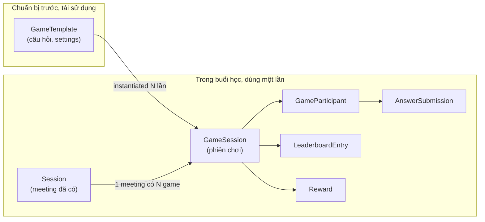
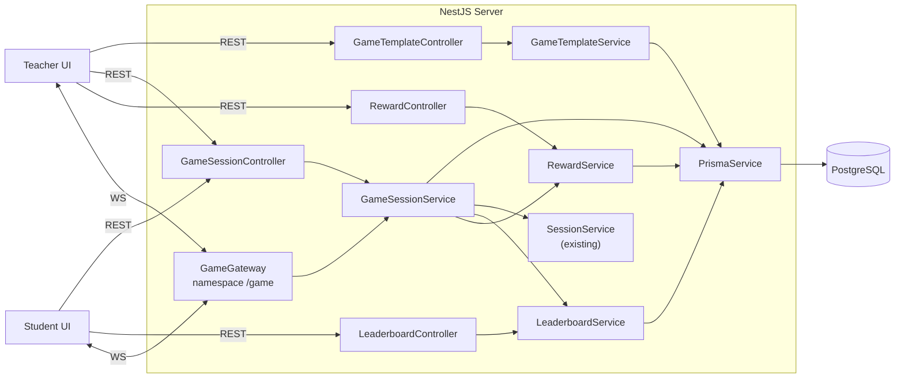
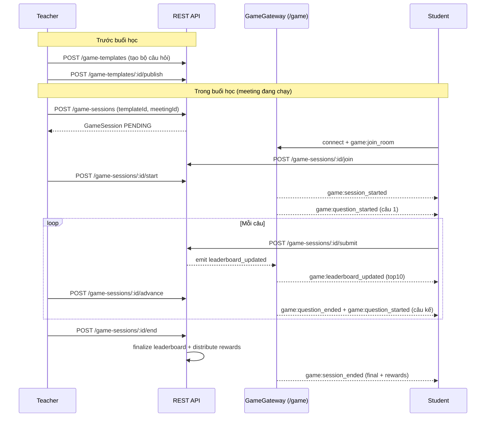

# 01 — Tổng quan & Kiến trúc Game Module

> Đọc file này để hiểu **bức tranh tổng thể** trước khi chạm code. File này không có code — chỉ khái niệm, sơ đồ, quy tắc.

---

## 1. Vấn đề cần giải quyết

Trong buổi học online (meeting giữa giáo viên và học sinh), giáo viên muốn chơi một **mini-game kiểu Kahoot** để kiểm tra nhanh: đưa câu hỏi, học sinh trả lời, bảng xếp hạng cuối game, top N nhận phần thưởng.

Game phải:

- Chuẩn bị **trước** buổi học (giáo viên soạn bộ câu hỏi → `GameTemplate`).
- Có thể **tái sử dụng** bộ câu hỏi trong nhiều buổi khác nhau.
- Khi chơi: tạo một **phiên game runtime** (`GameSession`) gắn với 1 meeting cụ thể.
- Hỗ trợ 2 loại câu hỏi: **MCQ** (trắc nghiệm) và **SHORT_ANSWER** (điền ngắn).

---

## 2. Nguyên tắc tách biệt bắt buộc



**Quy tắc vàng:**

- `GameTemplate` **không bao giờ** biết đến một meeting cụ thể.
- `GameSession` **luôn** gắn với đúng 1 `meeting_id` (FK tới `Session.id`).
- Tạo meeting **không** tự tạo game. Tạo game **không** tạo meeting. Hai flow tách biệt.

---

## 3. Module structure sẽ tạo mới

Tất cả code viết trong `apps/server/src/game/`. Cấu trúc:

```
apps/server/src/game/
├── game.module.ts
├── enums/
│   ├── game-type.enum.ts            # MCQ | SHORT_ANSWER
│   ├── game-session-status.enum.ts  # PENDING | ACTIVE | PAUSED | ENDED | CANCELLED
│   └── reward-tier.enum.ts          # GOLD | SILVER | BRONZE | PARTICIPATION
├── template/
│   ├── game-template.controller.ts
│   ├── game-template.service.ts
│   └── dto/
│       ├── create-template.dto.ts
│       ├── update-template.dto.ts
│       ├── create-question.dto.ts
│       └── template-response.dto.ts
├── session/
│   ├── game-session.controller.ts
│   ├── game-session.service.ts
│   ├── game.gateway.ts              # namespace /game
│   ├── guards/
│   │   ├── game-session-host.guard.ts
│   │   └── game-participant.guard.ts
│   └── dto/
│       ├── start-session.dto.ts
│       ├── submit-answer.dto.ts
│       ├── grant-stars.dto.ts
│       └── session-response.dto.ts
├── leaderboard/
│   ├── leaderboard.controller.ts
│   ├── leaderboard.service.ts
│   └── dto/leaderboard-entry.dto.ts
└── reward/
    ├── reward.controller.ts
    ├── reward.service.ts
    └── dto/reward.dto.ts
```

> **Ghi chú:** Trong Nest, bạn có thể tách thành nhiều sub-module (TemplateModule, SessionModule, LeaderboardModule, RewardModule) cùng được `GameModule` bao ngoài — hoặc gộp tất cả vào 1 `GameModule` duy nhất với nhiều controller/provider. Chọn cách **gộp 1 module** để đơn giản v1 (mid-level dev dễ hiểu).

### Đăng ký vào `AppModule`

Trong [`apps/server/src/app.module.ts`](../../apps/server/src/app.module.ts) thêm:

```ts
import { GameModule } from './game/game.module';

@Module({
  imports: [
    // ... các module có sẵn ...
    GameModule,
  ],
})
export class AppModule {}
```

### Nội dung `game.module.ts`

```ts
@Module({
  imports: [PrismaModule, UserModule, SessionModule, EventEmitterModule.forRoot()],
  controllers: [
    GameTemplateController,
    GameSessionController,
    LeaderboardController,
    RewardController,
  ],
  providers: [
    GameTemplateService,
    GameSessionService,
    LeaderboardService,
    RewardService,
    GameGateway,
    GameSessionHostGuard,
    GameParticipantGuard,
  ],
})
export class GameModule {}
```

---

## 4. Sơ đồ tương tác tổng thể



Điểm đáng chú ý:

- `GameSessionService` **đọc** `SessionService.findById(meetingId)` để xác thực meeting tồn tại + caller là host. Không gọi ngược lại.
- `GameGateway` là **output** của service (dùng `EventEmitter2` để service phát sự kiện, gateway subscribe), không đưa logic nghiệp vụ vào gateway.
- REST là authoritative. WS chỉ push cập nhật.

---

## 5. Tích hợp với MeetModule (loose coupling)

- Game Module **chỉ import** `SessionModule` (đã export `SessionService`). **Không import** `MeetModule`.
- Không thay đổi gì trong `MeetModule` hay `MeetGateway`.
- Nếu sau này muốn thông báo cho người trong room `/meet` biết "game đã bắt đầu", có thể lắng nghe event `game.session.started` từ `EventEmitter2` ở `MeetGateway` — việc này **ngoài phạm vi v1**, để sau.

---

## 6. Vòng đời một game (high-level)



---

## 7. Bảng phân quyền tóm tắt

| Hành động                                | ADMIN | TEACHER                      | STUDENT                 |
| ---------------------------------------- | :---: | :--------------------------: | :---------------------: |
| Tạo/sửa/xoá `GameTemplate`               |  ✅   | ✅ (chỉ template của mình)   |            ❌           |
| Publish template                         |  ✅   | ✅ (owner)                   |            ❌           |
| Tạo `GameSession` từ template            |  ✅   | ✅ (là host của meeting)     |            ❌           |
| Start/pause/resume/advance/end session   |  ✅   | ✅ (host của session)        |            ❌           |
| Join/leave session                       |  ❌   | ❌                           |            ✅           |
| Submit answer                            |  ❌   | ❌                           |   ✅ (là participant)   |
| Grant stars (chấm SHORT_ANSWER)          |  ✅   | ✅ (host của session)        |            ❌           |
| Xem leaderboard (live + final)           |  ✅   | ✅ (host hoặc teacher class) |   ✅ (là participant)   |
| Xem rewards                              |  ✅   | ✅ (host)                    |   ✅ (là participant)   |

Chi tiết cơ chế check quyền xem file [`04-game-logic.md`](./04-game-logic.md) mục Authorization.

---

## 8. Những thứ **không** làm ở v1

Để tránh over-engineering:

- Không có reward catalog (chỉ tier cố định).
- Không có câu hỏi kiểu true/false, match, drag-drop — chỉ MCQ và SHORT_ANSWER.
- Không có multi-language per question.
- Không có chấm đồng đội (team mode). Chơi cá nhân.
- Không có replay/export game.
- Không có file đính kèm trong câu hỏi (text only). Ảnh có thể gắn qua URL trong `settings` jsonb nhưng không render chuẩn hoá.

---

Bước kế tiếp: đọc [`02-database-schema.md`](./02-database-schema.md).
