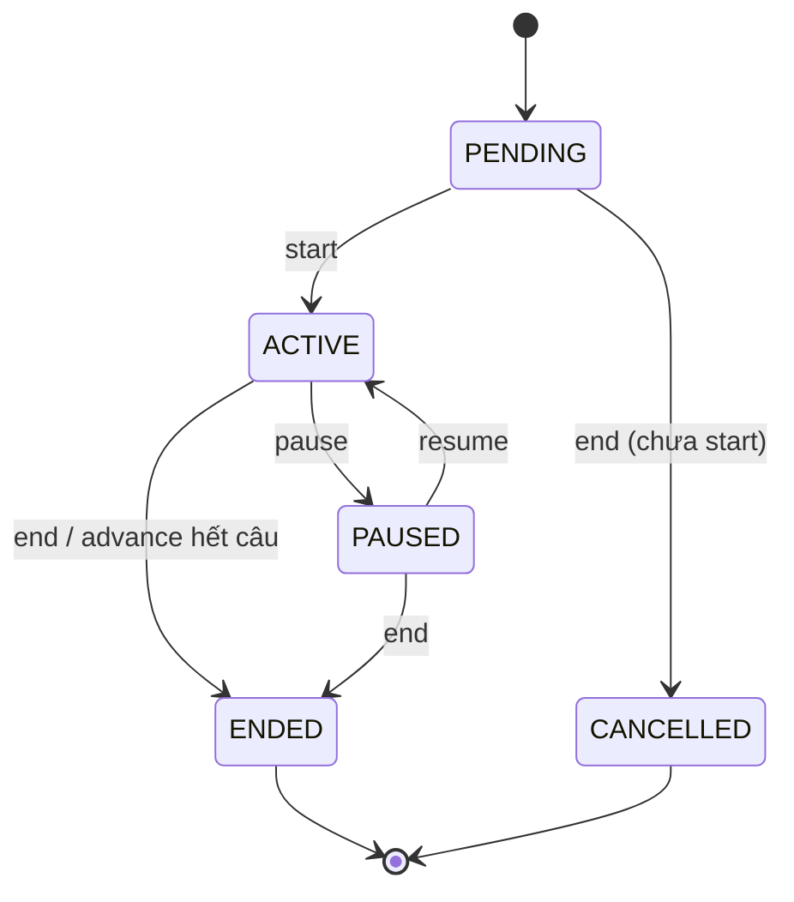

# 04 — Game Logic

> File này mô tả **nghiệp vụ**: state machine, công thức chấm điểm, leaderboard, edge case, phân quyền. Đây là phần dev dễ sai nhất — đọc kỹ.

---

## 1. State machine của `GameSession`



### 1.1 Transition hợp lệ

| Từ        | Sang      | Endpoint                       | Side effect                                                    |
| --------- | --------- | ------------------------------ | -------------------------------------------------------------- |
| PENDING   | ACTIVE    | `POST /start`                  | Set `started_at`, mở câu đầu                                   |
| PENDING   | CANCELLED | `POST /end` (khi PENDING)      | Set `ended_at`. Không snapshot leaderboard, không rewards.     |
| ACTIVE    | PAUSED    | `POST /pause`                  | Lưu `paused_at` (trong jsonb `settings` runtime hoặc field phụ)|
| PAUSED    | ACTIVE    | `POST /resume`                 | `current_question_started_at += (now - paused_at)`             |
| ACTIVE    | ENDED     | `POST /end` hoặc `/advance` khi hết câu | Snapshot leaderboard + distribute rewards             |
| PAUSED    | ENDED     | `POST /end`                    | Giống trên                                                     |

> Gọi endpoint không phù hợp trạng thái hiện tại → **409 `INVALID_STATE`**.

### 1.2 Đơn giản hoá v1 về `PAUSED`

Để đỡ phức tạp, v1 có thể làm **không có PAUSED field phụ**: khi pause chỉ đổi `status = PAUSED` và **reject submit**. Khi resume, đơn giản tính lại `current_question_started_at = now() - elapsed_before_pause`. Elapsed này có thể không lưu → **chọn policy A hoặc B:**

- **Policy A (đơn giản — khuyến nghị v1):** resume = reset đồng hồ, đặt `current_question_started_at = now()`. Học sinh có thêm full thời gian. Chấp nhận trade-off.
- **Policy B (chuẩn hơn):** thêm field phụ `paused_at` và `paused_elapsed_ms` trên `GameSession` để giữ thời gian đã tiêu.

**V1 dùng policy A.** Ghi chú trong doc cho QA biết.

---

## 2. Công thức chấm điểm

### 2.1 Mỗi bài nộp

**Đầu vào:**

- `question.time_limit_seconds` (ký hiệu `T`)
- `response_time_ms` (server tính) — ký hiệu `rt_ms`
- `isCorrect` — đúng/sai
- `question.points` — điểm cơ bản

**Công thức sao:**

```ts
function computeStars(isCorrect: boolean, rt_ms: number, T_sec: number): number {
  if (!isCorrect) return 0;
  const ratio = rt_ms / (T_sec * 1000);
  if (ratio <= 0.25) return 5;
  if (ratio <= 0.50) return 4;
  if (ratio <= 0.75) return 3;
  if (ratio <= 1.00) return 2;
  return 1; // nộp trong grace (đúng nhưng quá giờ < 2s)
}
```

**Điểm (points):**

```ts
const points = isCorrect ? question.points : 0;
```

### 2.2 Sau khi update submission — cập nhật participant

Trong **cùng 1 transaction** với write `AnswerSubmission`:

```ts
await tx.gameParticipant.update({
  where: { id: participantId },
  data: {
    total_stars:            { increment: starsDelta },
    total_points:           { increment: pointsDelta },
    total_response_time_ms: { increment: BigInt(rtMsDelta) },
  },
});
```

### 2.3 Delta accounting khi re-grading

Khi giáo viên `grant-stars` (hoặc submit lần đầu cho SHORT_ANSWER sau khi chấm):

```ts
const prev = submission; // bản ghi cũ
const newStars  = body.stars;
const newPoints = body.isCorrect ? question.points : 0;

const starsDelta  = newStars  - prev.stars_awarded;
const pointsDelta = newPoints - prev.points_awarded;
// response_time_ms KHÔNG đổi khi chấm → không update total_response_time_ms.
```

Update submission + delta apply trong 1 transaction. **Nhờ đó chấm lại N lần không bị cộng dồn sai.**

---

## 3. Chấm từng loại câu hỏi

### 3.1 MCQ — auto-chấm

Khi `POST /submit` (MCQ):

```ts
const question = await prisma.gameQuestion.findUniqueOrThrow(...);
const options = question.options as string[];
const selected = options[body.selectedOptionIndex];
const isCorrect = selected === question.correct_answer;
const stars  = computeStars(isCorrect, rtMs, question.time_limit_seconds);
const points = isCorrect ? question.points : 0;

// transaction:
await prisma.$transaction(async (tx) => {
  const sub = await tx.answerSubmission.create({
    data: {
      game_session_id, question_id, participant_id,
      selected_option_index: body.selectedOptionIndex,
      answer_text: null,
      is_correct: isCorrect,
      stars_awarded: stars,
      points_awarded: points,
      response_time_ms: rtMs,
      validated_by: null, validated_at: null,
    },
  });
  await tx.gameParticipant.update({
    where: { id: participant_id },
    data: {
      total_stars:            { increment: stars },
      total_points:           { increment: points },
      total_response_time_ms: { increment: BigInt(rtMs) },
    },
  });
  return sub;
});
```

Bắt `PrismaClientKnownRequestError` code `P2002` → ném `ConflictException('DUPLICATE_SUBMISSION')`.

### 3.2 SHORT_ANSWER — chờ giáo viên chấm

Khi `POST /submit`:

```ts
// transaction tương tự nhưng:
// - is_correct: null
// - stars_awarded: 0
// - points_awarded: 0
// - KHÔNG update total_stars / total_points
// - VẪN cập nhật total_response_time_ms (để tie-break công bằng)
```

Khi giáo viên gọi `POST /grant-stars`: dùng delta accounting ở mục 2.3.

### 3.3 Teacher override MCQ

Giáo viên vẫn được gọi `grant-stars` trên submission MCQ để sửa điểm (ví dụ câu hỏi bị lỗi, muốn cho tất cả cùng đúng). Flow y hệt delta accounting.

---

## 4. Leaderboard

### 4.1 Live leaderboard (on-the-fly)

Raw SQL qua `prisma.$queryRaw`:

```sql
SELECT
  p.id                         AS participant_id,
  p.user_id,
  u.full_name,
  u.avatar_url,
  p.total_stars,
  p.total_points,
  p.total_response_time_ms,
  RANK() OVER (
    ORDER BY
      p.total_stars            DESC,
      p.total_response_time_ms ASC,
      p.joined_at              ASC
  ) AS rank
FROM "GameParticipant" p
JOIN "User" u ON u.id = p.user_id
WHERE p.game_session_id = $1
ORDER BY rank ASC, p.joined_at ASC;
```

- Dùng `RANK()` (hoà hạng được phép) cho live view — ví dụ 2 người top 1.
- Sắp xếp:
  1. `total_stars DESC` — ai nhiều sao nhất xếp trên.
  2. `total_response_time_ms ASC` — cùng sao, ai nhanh hơn trên.
  3. `joined_at ASC` — cùng sao + cùng thời gian phản hồi, ai vào trước trên (rất hiếm, chỉ để deterministic).

- Index `(game_session_id, total_stars)` làm query này nhanh (< 50ms cho 200 participant).

### 4.2 Final leaderboard (snapshot)

Khi `POST /end`, chạy **trong transaction**:

```sql
INSERT INTO "LeaderboardEntry"
  (id, game_session_id, participant_id, rank, total_stars, total_points, total_response_time_ms, computed_at)
SELECT
  gen_random_uuid(),
  p.game_session_id,
  p.id,
  ROW_NUMBER() OVER (
    ORDER BY
      p.total_stars            DESC,
      p.total_response_time_ms ASC,
      p.joined_at              ASC
  ),
  p.total_stars,
  p.total_points,
  p.total_response_time_ms,
  now()
FROM "GameParticipant" p
WHERE p.game_session_id = $1;
```

> **Sự khác biệt quan trọng:** snapshot dùng `ROW_NUMBER()` (mỗi người 1 rank riêng) thay vì `RANK()` — để `Reward` phân phát được 1 người/hạng, không bị hoà top 1.

### 4.3 Khi nào leaderboard cập nhật?

- **Live:** tính khi client gọi `GET /leaderboard`, hoặc khi server push `game:leaderboard_updated` (sau mỗi submission / grant-stars, debounce 500ms).
- **Final:** chỉ 1 lần khi `end()`. Đọc lại bằng `GET /leaderboard/final`.

---

## 5. Phân phát Reward

Sau khi snapshot leaderboard, trong cùng transaction:

```ts
const config = session.reward_config as { top_n: number; tiers: RewardTier[] };
const topEntries = await tx.leaderboardEntry.findMany({
  where: { game_session_id: session.id, rank: { lte: config.top_n } },
  orderBy: { rank: 'asc' },
});

for (const entry of topEntries) {
  await tx.reward.create({
    data: {
      game_session_id: session.id,
      participant_id:  entry.participant_id,
      tier:  config.tiers[entry.rank - 1],
      rank:  entry.rank,
    },
  });
}
```

- Nếu số participant < `top_n` → chỉ phân phát theo số thực có.
- Endpoint `POST /rewards/distribute` (retry) **phải xoá rewards cũ** của session trước khi insert lại, để idempotent.

---

## 6. Edge cases bắt buộc xử lý

| Tình huống                          | Xử lý                                                                                                      | Status code / Error                  |
| ----------------------------------- | ---------------------------------------------------------------------------------------------------------- | ------------------------------------ |
| Học sinh nộp 2 lần cho cùng câu     | DB unique `(question_id, participant_id)` throw `P2002`                                                    | 409 `DUPLICATE_SUBMISSION`           |
| Học sinh nộp câu không phải câu hiện tại | `body.questionId !== session.current_question_id`                                                     | 409 `QUESTION_NOT_ACTIVE`            |
| Học sinh nộp muộn                   | `now() - current_question_started_at > time_limit + 2s`                                                    | 400 `LATE_SUBMISSION`                |
| Học sinh nộp khi session PAUSED     | Check `status === 'ACTIVE'`                                                                                | 409 `SESSION_PAUSED`                 |
| Học sinh chưa join mà nộp           | `GameParticipantGuard` không tìm thấy record                                                               | 403 `NOT_A_PARTICIPANT`              |
| Học sinh join muộn (giữa chừng)     | Cho phép khi `status ∈ {PENDING, ACTIVE}`; các câu đã qua = 0 điểm                                         | 200/201                              |
| Học sinh rời rồi join lại           | `join` idempotent: set `left_at = null`                                                                    | 200                                  |
| Teacher disconnect / mất mạng       | Session giữ `ACTIVE`. Cron job auto-end nếu ACTIVE > 2h không có submit (v1.1)                             | —                                    |
| Teacher ấn end khi PENDING          | Cho phép → `CANCELLED`. Không snapshot leaderboard, không rewards.                                         | 200                                  |
| Teacher gọi end 2 lần               | Idempotent — lần 2 trả về state hiện tại.                                                                  | 200                                  |
| Template chưa publish → start       | Check `is_published`                                                                                       | 400 `TEMPLATE_NOT_PUBLISHED`         |
| Meeting đã kết thúc → tạo game      | Check `meeting.end_time IS NULL`                                                                           | 409 `MEETING_NOT_ACTIVE`             |
| Meeting bị xoá giữa game            | `onDelete: Cascade` → game bị xoá theo. (Không phải bug, là contract.)                                     | —                                    |
| Số participant = 0 khi end          | Vẫn chuyển ENDED, không snapshot, không reward                                                             | 200                                  |
| Re-grading cùng submission N lần    | Delta accounting đảm bảo không cộng dồn sai                                                                | 200                                  |
| Tie-break trên leaderboard          | stars DESC → response_time ASC → joined_at ASC                                                             | Deterministic                        |
| Hoà top 1 trên live                 | `RANK()` cho phép nhiều người cùng rank 1 trên live view                                                   | —                                    |
| Hoà top 1 khi distribute reward     | `ROW_NUMBER()` chỉ 1 người nhận GOLD. Người còn lại nhận SILVER.                                           | —                                    |

---

## 7. Authorization cụ thể

### 7.1 Ma trận chi tiết

| Action                                               | Điều kiện PASS                                                                 | Guard                                           |
| ---------------------------------------------------- | ------------------------------------------------------------------------------ | ----------------------------------------------- |
| `POST /game-templates`                               | `role = TEACHER`                                                               | `AuthGuard + RoleGuard(TEACHER)`                |
| `PATCH/DELETE/publish /game-templates/:id`           | `template.created_by === user.id` **hoặc** `role = ADMIN`                      | `+ TemplateOwnerGuard`                          |
| `POST /game-sessions`                                | `role = TEACHER` + `meeting.host_id === user.id`                               | `AuthGuard + RoleGuard(TEACHER)` (logic trong service) |
| `POST /game-sessions/:id/{start,advance,pause,resume,end}` | `session.host_id === user.id` **hoặc** `role = ADMIN`                    | `+ GameSessionHostGuard`                        |
| `POST /game-sessions/:id/join`                       | `role = STUDENT` + `user` là ClassMember của class có meeting này              | `AuthGuard + RoleGuard(STUDENT)` + kiểm trong service |
| `POST /game-sessions/:id/submit`                     | `user` có `GameParticipant` với `left_at IS NULL` cho session này              | `+ GameParticipantGuard`                        |
| `POST /game-sessions/:id/grant-stars`                | `session.host_id === user.id`                                                  | `+ GameSessionHostGuard`                        |
| `GET /game-sessions/:id`, `/leaderboard*`, `/rewards`| `user` là participant **hoặc** host **hoặc** teacher của class meeting         | logic trong service (`canViewSession` helper)   |

### 7.2 Implement các Guard

**`GameSessionHostGuard`:** đọc param `:id`, fetch `GameSession`, so sánh `host_id === user.id`. Throw `ForbiddenException` nếu sai.

```ts
@Injectable()
export class GameSessionHostGuard implements CanActivate {
  constructor(private readonly prisma: PrismaService) {}
  async canActivate(ctx: ExecutionContext): Promise<boolean> {
    const req = ctx.switchToHttp().getRequest();
    const sessionId = req.params.id;
    const userId = req.user.id;
    const session = await this.prisma.gameSession.findUnique({ where: { id: sessionId } });
    if (!session) throw new NotFoundException('GameSession not found');
    if (session.host_id !== userId && req.user.role !== 'ADMIN') {
      throw new ForbiddenException('Not the host of this game session');
    }
    req.gameSession = session; // cache để service dùng lại
    return true;
  }
}
```

**`GameParticipantGuard`:** tương tự, fetch `GameParticipant` theo `(game_session_id, user_id)`, đảm bảo `left_at IS NULL`.

**`TemplateOwnerGuard`:** fetch template, check `created_by === user.id`.

> Đặt tất cả guard trong `apps/server/src/game/session/guards/` và `apps/server/src/game/template/guards/`.

---

## 8. Chống gian lận (v1)

- **Response time do server tính.** Bỏ qua `clientSubmittedAt` khi chấm (chỉ log để audit).
- **`correctAnswer` không được trả về student** trong `GET /game-sessions/:id`. Chỉ lộ ra sau `game:question_ended` qua WS.
- **Rate-limit submit:** dùng `@Throttle({ default: { limit: 3, ttl: 10_000 } })` cho endpoint submit để chặn spam (mặc dù unique DB đã chặn duplicate, throttle ngăn attacker probe).
- **Không trust client** về `questionId` — phải so với `current_question_id` thực tại server.

---

## 9. Transaction & concurrency

- **Mọi flow liên quan tới `GameParticipant.total_*` phải trong transaction** với submission / grant-stars.
- Dùng `prisma.$transaction` (Interactive Transaction) cho chuỗi read-then-write.
- Dùng `{ increment: ... }` trong `update` để tránh lost-update với 2 request gần nhau.
- Không cần row-level lock cho v1: `increment` đã atomic tại PostgreSQL.

---

## 10. Checklist logic (trước khi mở PR)

- [ ] Tất cả transition trạng thái đều check guard bằng `if (session.status !== ...) throw new ConflictException('INVALID_STATE')`.
- [ ] Submission: reject khi `status !== ACTIVE` hoặc `questionId !== current_question_id` hoặc quá `time_limit + 2s`.
- [ ] MCQ chấm đúng công thức stars theo 4 mốc %.
- [ ] Grant-stars dùng delta, không cộng dồn.
- [ ] End flow nằm trong **1 transaction**: update session + snapshot leaderboard + distribute reward.
- [ ] `POST /rewards/distribute` xoá rewards cũ trước khi insert lại.
- [ ] Idempotent: `join`, `end`, `distribute`, `publish` đều gọi nhiều lần không hỏng.
- [ ] Không lộ `correctAnswer` cho student trong response live.

---

Bước kế tiếp: đọc [`05-websocket-gateway.md`](./05-websocket-gateway.md).
