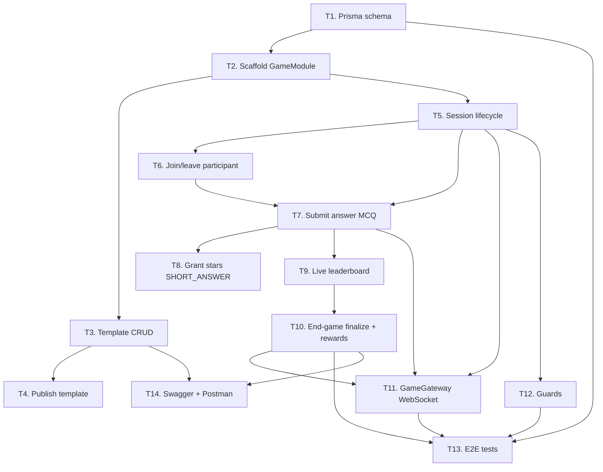

# 07 — Task Breakdown

> File này chia công việc thành **14 task** độc lập, mỗi task 0.5–2 ngày. Làm đúng thứ tự dependencies. Mỗi task = **1 PR** riêng, review nhanh hơn.

---

## 1. Sơ đồ dependency

---

## 2. Bảng task

| ID  | Task                                             | Ngày công | Phụ thuộc     | Owner   | PR branch                         |
| --- | ------------------------------------------------ | :-------: | ------------- | ------- | --------------------------------- |
| T1  | Prisma schema + enums + back-relations           |   0.5     | —             | BE      | `feat/game-t1-schema`             |
| T2  | Scaffold `GameModule` + register AppModule       |   0.5     | T1            | BE      | `feat/game-t2-scaffold`           |
| T3  | CRUD `GameTemplate` + validation MCQ/SA          |   2       | T2            | BE      | `feat/game-t3-template-crud`      |
| T4  | Publish template + pre-publish validation        |   0.5     | T3            | BE      | `feat/game-t4-template-publish`   |
| T5  | Lifecycle `GameSession` (5 transition)           |   2       | T2            | BE      | `feat/game-t5-session-lifecycle`  |
| T6  | Join / leave participant (idempotent)            |   1       | T5            | BE      | `feat/game-t6-participant`        |
| T7  | Submit answer (MCQ auto-grading)                 |   1.5     | T5, T6        | BE      | `feat/game-t7-submit-mcq`         |
| T8  | Grant stars + submissions listing                |   1       | T7            | BE      | `feat/game-t8-grant-stars`        |
| T9  | Live leaderboard (raw SQL)                       |   1       | T7            | BE      | `feat/game-t9-leaderboard`        |
| T10 | End flow + snapshot + reward distribution        |   1       | T9            | BE      | `feat/game-t10-end-rewards`       |
| T11 | `GameGateway` (WS + EventEmitter bridge)         |   1.5     | T5, T7, T10   | BE      | `feat/game-t11-gateway`           |
| T12 | `GameSessionHostGuard` + `GameParticipantGuard`  |   0.5     | T5            | BE      | `feat/game-t12-guards`            |
| T13 | E2E integration tests                            |   1.5     | T1..T12       | BE      | `feat/game-t13-e2e`               |
| T14 | Swagger decorator + Postman collection           |   0.5     | T3..T10       | BE      | `feat/game-t14-docs`              |

**Tổng:** ~14.5 ngày công.

---

## 3. Chi tiết từng task

### T1. Prisma schema + enums + back-relations (0.5d)

- Paste nội dung schema từ file [`02-database-schema.md`](./02-database-schema.md) vào [`apps/server/prisma/schema.prisma`](../../apps/server/prisma/schema.prisma).
- Thêm 4 back-relation vào `User`, 1 vào `Session`, 1 vào `Class`.
- Chạy `pnpm prisma format` + `pnpm prisma validate`.
- **KHÔNG** chạy `prisma migrate dev`. Đợi lead duyệt.
- **DoD:** Schema hợp lệ, PR review chỉ thay đổi file `schema.prisma`.

### T2. Scaffold GameModule (0.5d)

- Tạo cấu trúc thư mục `apps/server/src/game/` theo file [`01-tong-quan-kien-truc.md`](./01-tong-quan-kien-truc.md) mục 3.
- `game.module.ts` export `GameModule` (tạm chưa có controller, chỉ khung).
- Đăng ký vào [`apps/server/src/app.module.ts`](../../apps/server/src/app.module.ts).
- Thêm dependency `@nestjs/event-emitter` nếu chưa có (xem `package.json`).
- **DoD:** Server build + boot OK, `GET /api/v1/health` (nếu có) vẫn pass.

### T3. GameTemplate CRUD (2d)

- Controller: `GameTemplateController` với 5 endpoint 2.1–2.5 trong file 03.
- Service: `GameTemplateService.create/list/findOne/update/remove`.
- DTO: `CreateTemplateDto`, `UpdateTemplateDto`, `CreateQuestionDto`, `TemplateResponseDto`.
- Validation:
  - `orderIndex` unique trong request.
  - MCQ → options 2..6, correctAnswer ∈ options.
  - SHORT_ANSWER → options null, correctAnswer optional.
- Phân quyền: `AuthGuard + RoleGuard(TEACHER)` + `TemplateOwnerGuard` cho update/delete.
- Unit test cho service method create + validate rules.
- **DoD:** 5 endpoint pass trên Postman theo đúng contract + unit test pass.

### T4. Publish template (0.5d)

- Endpoint `POST /game-templates/:id/publish`.
- Pre-publish check: có ít nhất 1 câu hỏi; mỗi câu hỏi hợp lệ.
- Idempotent.
- **DoD:** Template đã publish không thể publish lại sai; start session được.

### T5. GameSession lifecycle (2d)

- Controller `GameSessionController` với endpoint 3.1–3.5, 3.8, 3.9 trong file 03.
- Service `GameSessionService`:
  - `createFromTemplate(dto, user)` — validate template published, meeting active, host.
  - `start(id, user)`, `advance(id, user)`, `pause(id, user)`, `resume(id, user)`, `end(id, user)`.
  - State machine check ở đầu mỗi method.
- Dùng `EventEmitter2` emit các event `game.session.started`, `game.question.started`, `game.question.ended`. (T11 sẽ subscribe.)
- **DoD:** Có thể dùng Postman để chạy hết flow PENDING → ACTIVE → ENDED.

### T6. Join / leave participant (1d)

- `POST /game-sessions/:id/join`, `/leave` (endpoint 3.6, 3.7).
- Service `GameParticipantService` (hoặc method trong `GameSessionService`):
  - `join(sessionId, userId)` — idempotent.
  - `leave(sessionId, userId)` — set `left_at`.
- Check: user là ClassMember của class của meeting.
- **DoD:** Join 2 lần không tạo 2 row; leave rồi join lại thì `left_at` unset.

### T7. Submit answer MCQ (1.5d)

- Endpoint `POST /game-sessions/:id/submit` (4.1).
- Service method `submitAnswer(sessionId, userId, dto)`:
  - Lock: check `status = ACTIVE`, `questionId = current_question_id`, not late.
  - Tính `response_time_ms` từ server.
  - MCQ: chấm ngay → compute stars/points.
  - SHORT_ANSWER: lưu với `is_correct = null, stars = 0, points = 0` (KHÔNG update total_stars/points, CÓ update total_response_time_ms).
  - Transaction: create submission + update participant.
  - Bắt P2002 → 409.
- Emit event `game.submission.received` + `game.leaderboard.updated` (debounce).
- **DoD:** TC-03, TC-04, TC-08 pass.

### T8. Grant stars SHORT_ANSWER (1d)

- Endpoint `POST /game-sessions/:id/grant-stars` (4.2) + `GET /game-sessions/:id/questions/:questionId/submissions` (4.3).
- Service method `grantStars(sessionId, userId, dto)`:
  - Delta accounting như file 04 mục 2.3.
  - Update submission + participant trong 1 transaction.
  - Emit `game.leaderboard.updated`.
- Listing endpoint với param `onlyUnvalidated`.
- **DoD:** TC-02, TC-06 pass.

### T9. Live leaderboard (1d)

- Endpoint `GET /game-sessions/:id/leaderboard` (5.1).
- Service `LeaderboardService.getLive(sessionId, { limit? })` — raw SQL theo file 04 mục 4.1.
- DTO convert `BigInt` → `number`.
- **DoD:** TC-05 pass; `EXPLAIN ANALYZE` dùng Index Scan.

### T10. End-game finalize + rewards (1d)

- Bổ sung vào `GameSessionService.end(...)`:
  - Trong transaction: set ENDED, snapshot `LeaderboardEntry` bằng ROW_NUMBER(), distribute `Reward` theo `reward_config`.
- Endpoint `GET /game-sessions/:id/leaderboard/final` (5.2).
- Endpoint `GET /game-sessions/:id/rewards` (6.1).
- Endpoint `POST /game-sessions/:id/rewards/distribute` (6.2) — xoá reward cũ, insert lại.
- Emit event `game.session.ended`.
- **DoD:** TC-01, TC-09 pass; invariant ở file 06 mục 2.2 đúng.

### T11. GameGateway WebSocket (1.5d)

- File `apps/server/src/game/session/game.gateway.ts` theo khung file 05.
- Namespace `/game`, auth JWT.
- Subscribe 6 event `game.*` qua `@OnEvent`.
- Handle `game:join_room` / `game:leave_room`.
- Debounce leaderboard (đã có trong service, gateway chỉ relay).
- Tracking `userSockets` để send riêng cho host.
- **DoD:** Client socket.io thử join + nhận đủ 6 loại event khi chạy flow E2E.

### T12. Guards (0.5d)

- `GameSessionHostGuard`, `GameParticipantGuard`, `TemplateOwnerGuard`.
- Gắn `@UseGuards(...)` vào các route cần (xem bảng mục 7 file 03).
- Unit test cho guard (mock Prisma).
- **DoD:** TC-07 pass; non-participant submit → 403.

### T13. E2E integration tests (1.5d)

- Test file `apps/server/test/game.e2e-spec.ts` (theo pattern Nest E2E đã có).
- Seed 1 teacher + 5 students + 1 class + 1 meeting + 1 template MCQ.
- Ít nhất chạy: TC-01 (happy path), TC-04 (duplicate), TC-07 (non-host).
- Chạy qua `pnpm --filter @idest/server test:e2e`.
- **DoD:** Test pass trong CI; coverage cho `src/game/` ≥ 70%.

### T14. Swagger + Postman (0.5d)

- Thêm `@ApiOperation`, `@ApiResponse`, `@ApiBody` cho mọi endpoint.
- Export Swagger JSON → commit vào `apps/server/docs/game-openapi.json`.
- Tạo Postman collection từ Swagger (có thể dùng `openapi-to-postman`) → `apps/server/docs/game.postman_collection.json`.
- **DoD:** Swagger UI hiển thị đầy đủ; import Postman chạy được.

---

## 4. Gợi ý workflow

1. Làm T1 → lead duyệt schema → mới tiếp tục.
2. T2 merge nhanh (nhỏ, blocker cho nhiều task).
3. **Chạy song song:** sau T2, có thể làm T3+T4 (template) và T5+T6 (session) ở 2 branch khác nhau.
4. T7 → T8 → T9 → T10 theo thứ tự tuần tự.
5. T11, T12 làm bất cứ lúc nào sau khi các task phụ thuộc xong.
6. T13, T14 làm cuối cùng khi mọi thứ stable.

---

## 5. Rủi ro & cách giảm

| Rủi ro                                                    | Cách giảm                                                                         |
| --------------------------------------------------------- | --------------------------------------------------------------------------------- |
| Migrate Prisma phá DB dev hiện tại                        | T1 không chạy migrate, chỉ sửa file. Lead review xong mới migrate trên môi trường test riêng trước. |
| Race condition khi 50 học sinh submit cùng lúc            | Dùng `{ increment }` trong Prisma update (atomic tại DB). Không dùng read-then-write. |
| Gateway circular dep với service                          | Dùng `EventEmitter2` (pattern đã ghi trong file 05).                               |
| Lộ `correctAnswer` cho student                            | Tách DTO `PublicQuestionDto` **không** có `correctAnswer`. Test E2E assert.        |
| Reward phân phát sai khi có tie                           | Dùng `ROW_NUMBER()` (không phải `RANK()`) khi snapshot.                            |
| Double-count điểm khi re-grading                          | Delta accounting bắt buộc (file 04 mục 2.3).                                       |
| Test E2E flaky vì WS                                      | Test chủ yếu qua REST; WS test riêng nhỏ (chỉ 1–2 case) để không phụ thuộc timing. |

---

## 6. Definition of Done cho cả project

- [ ] Cả 14 task merge vào `main`.
- [ ] Acceptance criteria trong file 06 pass.
- [ ] CI xanh.
- [ ] Doc `docs/game-module/*` không bị outdated so với code (nếu có thay đổi, update song song).
- [ ] Demo end-to-end 1 lần cho lead.

---

Chúc code vui.
Gặp vướng mắc: mở issue GitHub + tag lead + dán link doc section cụ thể để bàn nhanh.
